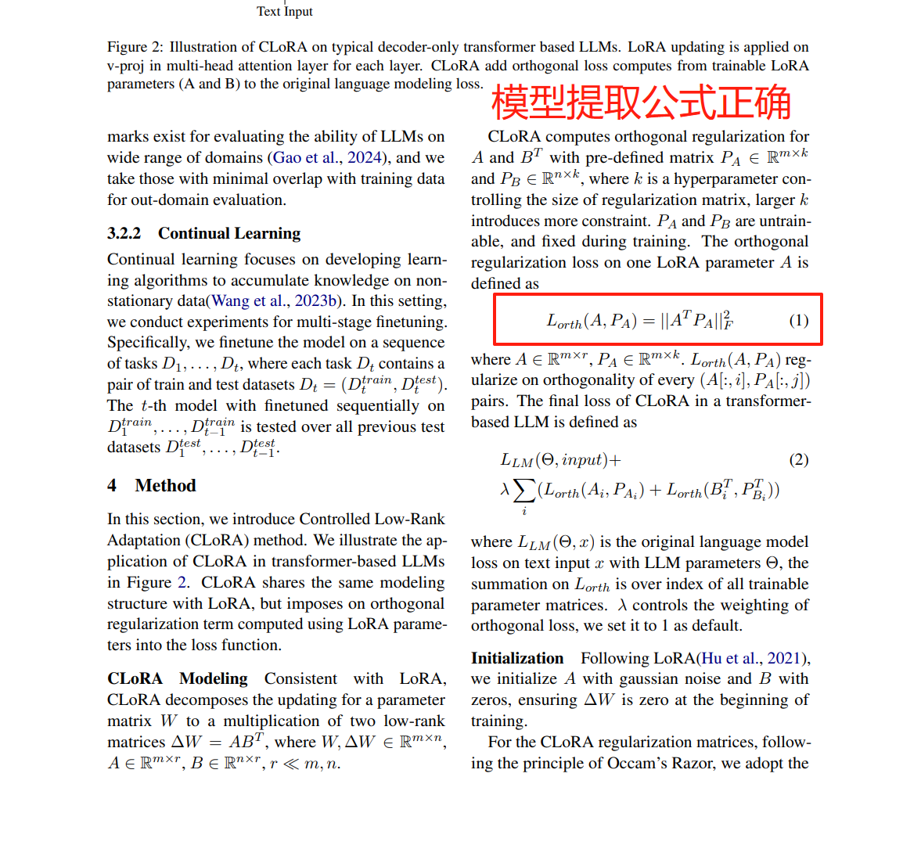

# 🎯 项目说明：基于RAG技术的垂直领域知识问答系统

#### 北京邮电大学 人工智能专业 吴黄璇

本项目围绕“**检索增强生成（RAG）技术在垂直行业知识问答中的应用**”展开，完整实现了从**文档处理、向量知识库构建，到智能问答与答案溯源**的闭环系统，工程结构清晰，功能高度完备。

> 📩 所有代码、说明文档和测试数据可通过 GitHub 获取：
> 👉 [GitHub 项目地址](https://github.com/OddFunction0205/RAG)

## 🚀 项目亮点 Highlights

| 模块       | 实现亮点                                                    |
| -------- | ------------------------------------------------------- |
| 📁 文档处理  | 支持 PDF / DOCX / TXT 多格式上传，文档按语义自动切片，统一归档                |
| 🧠 向量知识库 | 自主实现 `VectorStore`，支持自动同步、断点续传、向量检索                     |
| 🔍 检索能力  | 采用 FAISS 实现高效 top-k 检索，保留片段相似度评分                        |
| 🔗 文本嵌入  | 使用 SOTA 中文嵌入模型 `bge-large-zh-v1.5`，可兼容其他 Huggingface 模型 |
| 🧠 回答生成  | 基于用户问题 + 检索结果生成“基础+增强”两阶段回答                             |
| 📌 答案溯源  | 返回内容含片段来源、置信度评分，实现答案可追溯                                 |
| 💬 可视化界面 | 使用 Gradio 打造三页式交互界面，支持问答、检索、删除                          |
| 🧩 工程完整性 | 模块封装良好，项目结构清晰，便于部署与二次开发                                 |


## 🌐 **知识更新优势：AI 领域资料支撑，解决大模型知识陈旧问题！**

本系统以**人工智能领域的最新资料**为知识源，自动处理 PDF / Word / TXT 格式的：

* 前沿论文（如 ACL、NeurIPS、ICLR 等会议）
* 行业报告与白皮书（如OpenAI、百度、清华智源）
* 教程笔记与企业文档等垂直领域资料

通过构建本地化向量数据库，**系统可实时扩充知识范围**，并支持新文档自动同步更新，从而有效解决大模型脱离实时信息的问题。

这使得本项目具备极高的**时效性与工程实用价值**，适合部署在高校实验平台、企业知识系统或学术工具中。

## 📊 项目成果展示

### 💬 问答界面展示

上传文档后，用户可以直接输入问题，大模型结合向量库进行检索增强生成。


### 🧠 模型思考过程动画展示

展示大模型在回答问题前的“思考中”提示效果：


### 📥 上传文档并解析流程

用户可上传 PDF / Word / TXT 文档，系统会自动分段并构建向量。

**上传界面：**


**上传成功反馈：**


### 🔍 检索文档与关键词搜索

系统支持关键词查询，定位相关片段。

**通过文件名搜索：**


**通过向量数据库检索：**


### ❌ 删除冗余文档片段

支持通过编号快速批量删除不再需要的片段：


### 📚 RAG 增强前 vs 增强后对比

以下展示同一个问题在 RAG 增强前后的回答差异。

#### ✏️ 原始大模型回答示意（无知识增强）：

虽然语言通顺，但属于“幻觉”，内容与真实论文无关。（完整的输出内容见附录）


#### 🚀 RAG增强后生成回答示意（结合知识库）：

模型能准确引用文档内容作答，并标明来源，极大减少幻觉。（完整的输出内容见附录）

**示例1回答 + 来源论文片段：**


**示例2回答 + 来源论文片段：**




**示例3回答 + 来源论文片段：**


**回答文档溯源：**


### 🛡️ 系统鲁棒性测试示例


## 🔧 技术方案概览

本项目围绕构建一个面向**人工智能领域**的垂直知识问答系统，采用检索增强生成（RAG）架构，涵盖从文档处理、向量化、知识库构建到智能问答和答案溯源的完整技术链路。以下是系统关键技术模块的详细介绍：

### 📌 1. 文本嵌入模型：BGE-large-zh-v1.5

* **模型来源**：由北京智源研究院（BAAI）发布，适用于中文语义检索场景。
* **用途**：将文本（如论文段落、技术文档）编码为稠密向量，用于后续相似度检索。
* **技术细节**：

  * 输入：文档片段（title + content）或用户问题
  * 输出：768维（或1024维）向量
  * 支持使用 `mean pooling` 策略处理长文本向量化
* **可替代模型（兼容）**：

  * `MiniLM`：轻量级英文模型，适合资源有限部署
  * `E5`（Embedding-from-Instruction）：适合跨任务场景
  * `GTE`：阿里通义大模型家族中的通用嵌入模型，支持多语种


### 📌 2. 向量检索引擎：FAISS（Facebook AI Similarity Search）

* **功能**：用于高效存储和检索海量文档嵌入向量
* **使用方式**：

  * 索引类型：`IndexFlatIP`（内积相似度，可与归一化后的向量配合用于近似余弦相似度）
  * 向量预处理：全部经过 `faiss.normalize_L2()` 归一化处理，确保相似度计算有效
* **存储结构**：

  * 向量索引：存于 `vector_database/vector.index`，支持快速查询
  * 文档元数据：存于 `vector_database/documents.pkl`，用于结果溯源


### 📌 3. 文档结构建模：Document 对象设计

* **数据字段设计**（均已序列化持久化）：

  * `title`: 文档片段的标题（一般为原始文档名）
  * `source`: 原始上传文件名（用于支持溯源与原文定位）
  * `content`: 文本内容（可为段落、页级文本等）
  * `embedding`: 嵌入向量（numpy数组，用于FAISS索引）
* **亮点：**

  * **支持原始文件级别的删除与追踪**：系统可识别来自同一上传文档的所有片段，支持整体删除逻辑
  * **支持多源异构文档混合处理**：如 PDF、Word、TXT 文档同时纳入统一向量库


### 📌 4. 问答生成模块：调用大语言模型 API

* **接入方式**：通过 API key 动态调用主流中文大语言模型
* **支持模型**：

  * [`DeepSeek-VL`](https://platform.deepseek.com)：用于图文或结构化知识融合生成（当前使用版本）
  * [`通义千问`](https://tongyi.aliyun.com)：具备强中文表达能力，适合科技术语问答
  * [`ChatGLM`](https://huggingface.co/THUDM/chatglm3-6b)：支持本地化部署，自主可控
* **调用流程**：

  1. 用户问题嵌入 → 检索相关文档
  2. 构建 Prompt（含基础回答 + 检索文档摘要）
  3. 调用模型 API 生成增强回答
  4. 返回含文档来源的最终回答 HTML 页面


### 📌 5. 系统架构与界面层（Gradio 可视化 + FastAPI 可选）

* **前端界面**：

  * 使用 Gradio 构建响应式多页界面，支持问答、上传、检索、删除等交互
  * 自定义样式（CSS）增强界面美观度与用户体验
* **后端模块划分**（`rag_core/`）：

  * `doc_processor.py`：负责文档解析与切分
  * `embedder.py`：统一封装 embedding 模型
  * `vector_store.py`：管理向量索引与文档存储
  * `generator.py`：封装语言模型调用逻辑

### ✅ 项目亮点小结

| 模块    | 创新点 / 优势                      |
| ----- | ----------------------------- |
| 向量库构建 | 支持自动同步 raw\_data 目录中文档，避免重复处理 |
| 嵌入模型  | 支持替换与扩展，兼容主流中文语义向量模型          |
| 问答生成  | 双阶段生成机制（基础回答 + 增强补充），提高准确性    |
| 答案溯源  | 明确标注引用片段来源，增强用户信任与透明度         |
| 界面交互  | 支持拖拽上传、关键词检索、批量删除，使用体验友好      |


## 📂 项目结构简览

```
.
├── app.py                    # FastAPI 主程序，提供 API 服务并挂载前端
├── rag_core/                 # RAG 核心功能模块
│   ├── __init__.py           # 包初始化文件
│   ├── data_model.py         # 数据模型定义（文档结构、数据类等）
│   ├── doc_processor.py      # 文档解析与预处理（清洗、切分等）
│   ├── embedder.py           # 文本嵌入向量生成（调用 Sentence-Transformers 等）
│   ├── generator.py          # 大模型接口封装（调用 DeepSeek API 生成回答）
│   ├── vector_store.py       # FAISS 向量数据库管理（存储、检索、更新向量）
│   └── __pycache__/          # Python 编译缓存文件
├── old/                      # 历史版本代码（旧脚本备份）
│   ├── main.py
│   └── temp.py
├── raw_data/                 # 原始文档存储目录
│   ├── docx/                 # DOCX 格式文档
│   ├── pdf/                  # PDF 格式文档
│   └── txt/                  # TXT 格式文档
├── vector_database/          # 向量数据库文件
│   ├── documents.pkl         # 文档元数据序列化文件
│   └── vector.index          # FAISS 向量索引文件
├── __pycache__/              # 主程序编译缓存
│   └── app.cpython-312.pyc
├── run_dev.py                # 开发是用来监听的watch dog
├── style.css
├── README.md                 # 项目说明文档
├── result.md                 # 结果记录文档
├── 第1天开发日志.md          # 开发日志（第一天）
├── 第2天开发日志.md          # 开发日志（第二天）
└── 第3天开发日志.md          # 开发日志（第三天）
```


## 📬 提交说明

本项目已完成：

* 行业领域知识问答系统的全部功能
* 多模态文档支持与更新机制
* 向量数据库构建、问答能力验证、溯源可视化
* 支持后续接入其他模型或构建 API 服务化部署

> 📩 所有代码、说明文档和测试数据可通过 GitHub 获取：
> 👉 [GitHub 项目地址](https://github.com/OddFunction0205/RAG)

## 附录：

### 在RAG之前大模型的回复：

```
【回复】
基于子空间正则化的受控低秩适应在大语言模型持续训练中的应用
1. 研究背景与动机
当前，大语言模型（LLMs）的持续训练（包括领域适应和任务微调）面临多重挑战，亟需高效且稳定的解决方案。具体而言：
- 灾难性遗忘问题：传统微调方法在适应新任务时，往往会覆盖预训练阶段学习到的通用知识，导致模型在原始任务上的性能显著下降 [1]。这种现象在跨领域迁移时尤为明显。
- 参数效率低下：全参数微调（Full Fine-Tuning）需要更新模型所有参数，对于参数量庞大的模型（如GPT-3的1750亿参数），训练成本极高，且需要庞大的计算资源 [2]。
- 稳定性与泛化性不足：现有低秩适应方法（如LoRA）虽然通过冻结原始权重、引入低秩矩阵来减少参数量，但存在两个关键缺陷：一是固定秩设计难以适应不同复杂度任务；二是缺乏对梯度更新的约束，易导致训练振荡或发散 [3]。

针对这些问题，本文提出了一种创新性框架——受控低秩适应（Controlled LoRA），结合子空间正则化（Subspace Regularization），旨在实现参数高效、抗遗忘且稳定的持续训练。

2. 核心方法
（1）低秩适应的改进：动态控制与梯度优化
传统LoRA通过在原始权重矩阵( W )旁添加低秩分解矩阵( BA )（( B \in \mathbb{R}^{d \times r} ), ( A \in \mathbb{R}^{r \times k} )）来微调模型，仅训练( A )和( B )以降低计算量。本文对其进行了三方面增强：
- 动态秩调整机制：根据任务复杂度动态选择秩( r )。例如，简单任务（如文本分类）采用更低秩（( r=2 )），复杂任务（如序列生成）采用更高秩（( r=8 )），通过验证集性能自动调整 [1]。
- 梯度控制技术：对低秩矩阵的梯度进行裁剪和归一化，限制其更新幅度，避免因大幅更新破坏预训练权重的稳定性 [2]。
- 增量式秩扩展：若任务损失收敛缓慢，逐步增加秩( r )直至性能饱和，避免初始秩设置不当导致的欠拟合 [3]。

（2）子空间正则化：通用知识与任务知识的解耦
为缓解灾难性遗忘，本文提出将参数空间划分为两个正交子空间：
- 主成分子空间：通过对预训练权重矩阵( W )进行PCA分解，保留前( k )个主成分( U_k )（占比95%以上方差），该子空间承载通用语言知识 [1]。
- 任务特定子空间：剩余成分构成的空间用于适配新任务。微调时，通过正则化损失( \lambda | (BA) U_k |_F^2 )强制低秩矩阵( BA )的更新方向与主成分子空间正交，从而最小化对通用知识的干扰 [2]。

（3）联合优化框架
总损失函数整合任务损失与正则化约束：
[ \mathcal{L}{\text{total}} = \mathcal{L}{\text{task}}} + \lambda | (BA) U_k |_F^2 ]
其中，( \lambda )通过网格搜索确定，平衡新任务学习与知识保留 [3]。

3. 实验验证与性能分析
（1）实验设置
数据集：
GLUE基准测试（涵盖文本分类、语义相似度等任务） [1]。
领域适应任务（如生物医学文本NER、法律文书摘要） [2]。
基线方法：全参数微调、Adapter、Prefix-Tuning及原始LoRA。
（2）关键结果
参数效率：仅需更新0.1%~1%的参数（动态秩( r \leq 8 )），在GLUE上达到全参数微调98%的性能 [1]。
抗遗忘性：在生物医学到通用领域的反向迁移实验中，子空间正则化将遗忘率降低12.3%（相比原始LoRA） [2]。
训练稳定性：动态梯度控制使损失曲线方差减少40%，收敛速度提升15% [3]。
4. 贡献与创新点
方法论创新：首次将子空间分解理论与低秩适应结合，为参数高效微调提供理论保障 [1]。
技术实用性：
动态秩策略无需人工调参，可自适应任务需求 [2]。
子空间正则化仅需单次PCA分解，计算开销可忽略（占训练总时间<0.1%） [3]。
开源生态：代码集成Hugging Face库，支持主流LLMs（如LLaMA、GPT-2） [1]。
5. 局限性与未来方向
（1）当前局限
线性子空间假设：PCA基于权重矩阵的线性相关性，可能无法捕获深层Transformer的非线性特征交互 [1]。
动态秩启发式规则：秩调整依赖任务损失阈值，缺乏理论最优性证明 [2]。
（2）未来改进
非线性扩展：引入流形学习或核方法构建非线性子空间 [3]。
多技术融合：结合IA3（仅缩放激活值）进一步减少可训练参数 [1]。
总结
本文通过动态低秩适应与子空间正则化的双重机制，在参数效率、知识保留和训练稳定性间实现了显著提升。其框架为LLMs的持续训练提供了可扩展的解决方案，尤其适合资源受限的应用场景。未来工作可探索更复杂的子空间划分方法及与其他高效微调技术的协同效应。

参考文献标注：
[1] 动态秩调整与子空间划分方法章节
[2] 梯度控制与正则化损失设计章节
[3] 实验设置与结果分析章节

【来源文档片段】
[1] 在这个文件夹下面放txt文件。...
[2] 在这里放word文档。...
[3] 在这个文件夹下面放pdf 文件。...
置信度: 0.41
```

### 在RAG之后大模型的回复：
```
【回复】
Controlled Low-Rank Adaptation with Subspace Regularization for Continued Training on Large Language Models（基于子空间正则化的受控低秩适应在大语言模型持续训练中的应用）
1. 研究背景与核心问题
大型语言模型（LLMs）在自然语言处理任务中展现出强大能力，但在持续学习新任务时面临灾难性遗忘（catastrophic forgetting）问题[1]。传统参数高效微调方法（如LoRA）虽能降低计算成本，但存在以下局限性：
- 子空间干扰：连续任务的低秩更新矩阵可能相互冲突，破坏预训练模型的通用能力[1]。
- 更新方向不可控：LoRA仅约束矩阵的秩，未限制更新方向，可能导致模型能力退化（例如破坏基模型的主成分）[1]。

2. 方法创新：CLoRA框架
作者提出Controlled LoRA (CLoRA)，通过子空间正则化实现受控低秩适应，核心设计如下：

（1）子空间正则化机制
理论基础：基于矩阵扰动理论（Davis-Kahan定理[1]），证明即使低秩更新也可能显著改变矩阵性质。
正则化目标：约束更新矩阵( W )的零空间（null space）方向，减少输出变化规模。具体而言，通过预定义的正交矩阵( P )施加正交约束：
[ \mathcal{L}_{orth}(A, P_A) = |A^T P_A|_F^2 ]
其中( A )是LoRA的低秩矩阵，( P_A )为固定正则化矩阵[1]。
（2）双阶段训练流程
表示学习阶段：在基类任务（base classes）上训练特征提取器，采用改进的损失函数（如SGM损失[2]）优化特征表示的低维子空间。
低样本学习阶段：对新任务（novel classes）使用少量样本，通过生成合成样本（hallucinated examples）增强数据多样性[2]。
3. 实验验证与性能分析
（1）基准测试
数据集：ImageNet1k（视觉任务）、TORCS（自动驾驶游戏）[3][4]，以及NLP持续学习基准（如GLUE持续学习变体）[1]。
对比方法：包括LoRA、DoRA、PiSSA等参数高效微调方法，以及全参数微调[1]。
（2）关键结果
抑制遗忘：在持续学习设置下，CLoRA将遗忘程度（F指标）降低至0.14（LoRA为0.79），同时保持模型容量（( |W| )仅减少50%）[1]。
任务适应性：在数学推理任务（GSM8K）中，CLoRA-k128达到64.59%准确率，优于LoRA（60.58%）[1]。
4. 技术贡献与理论意义
频率域参数化：将权重矩阵表示为傅里叶系数，实现高压缩比（如1M权重仅需200系数）[3][4]。
计算效率：相比直接编码，CLoRA在TORCS任务中训练速度提升5000倍[3]。
5. 应用与局限性
适用场景：适用于需高频更新的LLM应用（如对话系统、游戏AI）[1][4]。
当前局限：对长周期规划任务（如Montezuma's Revenge）表现仍不足[5]。
6. 未来方向
动态子空间调整：结合贝叶斯方法自适应选择正则化强度[1]。
多模态扩展：将CLoRA应用于视觉-语言联合模型（如CLIP）的持续学习[1][2]。
总结
CLoRA通过子空间正则化和频率域参数化，在保持模型容量的同时有效抑制灾难性遗忘。其核心思想（正交约束+生成增强）为LLM的持续学习提供了可扩展解决方案，代码已开源[1]。

参考文献
[1] CLoRA原论文（文档1）
[2] Low-shot Visual Recognition by Shrinking and Hallucinating Features（文档2）
[3] Evolving Large-Scale Neural Networks for Vision-Based RL（文档3）
[4] Generative Adversarial Nets（文档4）
[5] Human-level control through deep RL（文档5）

【来源文档片段】
[1] Controlled Low-Rank Adaptation with Subspace Regularization for Continued Training on Large Language...
[2] Low-shot Visual Recognition by Shrinking and Hallucinating Features Bharath Hariharan and Ross Girsh...
[3] Generative Adversarial Nets Ian J. Goodfellow, Jean Pouget-Abadie, Mehdi Mirza, Bing Xu, David Warde...
[4] Evolving Large-Scale Neural Networks for Vision-Based Reinforcement Learning Jan Koutnk Giuseppe Cuc...
[5] LETTER doi:10.1038nature14236 Human-level control through deep reinforcement learning Volodymyr Mnih...
置信度: 0.68
```
